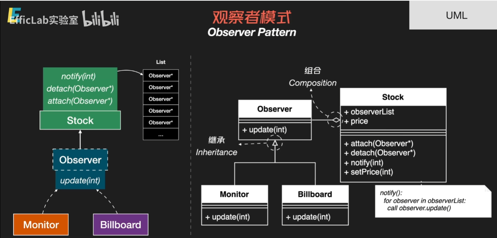
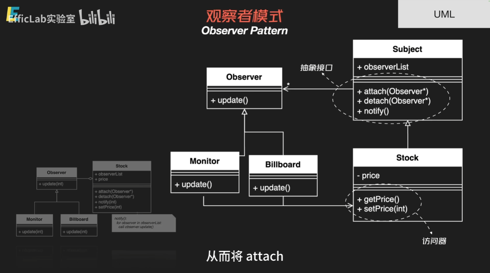
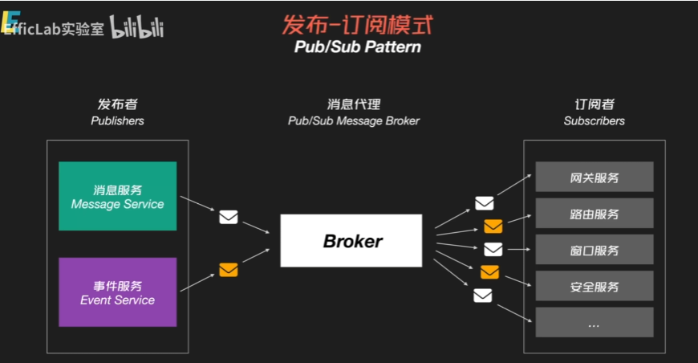

## 设计模式

### 前置知识

#### 左值引用与右值引用

**左值引用（T&）**

默认左值引用只能绑定到非临时的左值对象。
加上const后（即const T&），可以绑定到右值（临时对象），因为const保证了引用的对象不会被修改，这样也可以延长临时对象的生命周期，使其在引用作用域内有效。

**右值引用（T&&）**

默认右值引用只能绑定到右值（临时对象），因为右值引用通常用于表示一个即将被销毁的对象，可以被安全地“偷取”或“移动”其资源。
加上const后（即const T&&），表示一个对右值的常量引用。这种引用既不能用于修改，也无法转移资源，仅用于对右值的只读访问。
```cpp
void process(const std::string& s) {
    // 左值引用（加 const），可以接收左值或右值
    std::cout << "Const lvalue ref: " << s << std::endl;
}

void process(std::string&& s) {
    // 右值引用，仅接收右值
    std::cout << "Rvalue ref: " << s << std::endl;
}

int main() {
    std::string str = "Hello";
    process(str);        // 调用 const 左值引用函数
    process("World");    // 调用右值引用函数
}
```
- 左值引用T&无法绑定右值;const T&可以绑定右值。
- 右值引用T&&无法绑定左值;const T&&很少使用，因为它不能转移资源。

### 观察者模式

#### 核心思想

观察者模式核心是对观察者的抽象，以及所观察的对象如何通过attach,detach,notify来维护观察者集合

#### UML

初版抽象接口



将stock再次抽象继承自Subject



#### 观察者模式&发布订阅模式

- 发布订阅模式通常是一种架构模式，用来规定一个系统中的不同部分之间如何进行消息传递，主要针对组件/服务层次
- 观察者模式是一种软件设计模式，主要针对代码层级，指定类与类之间的组织关系

