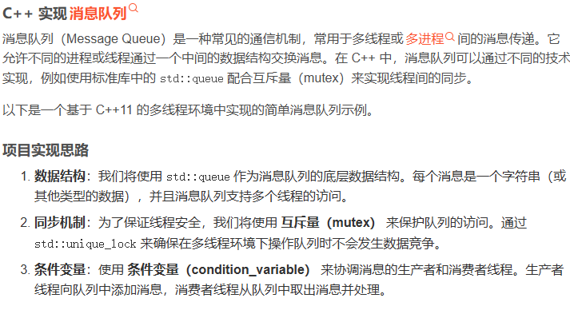
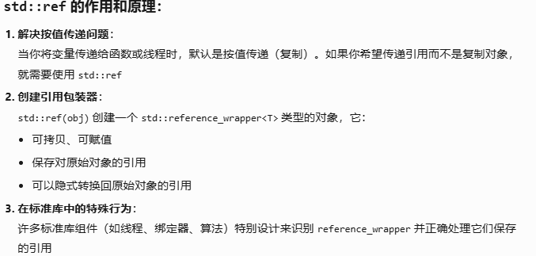
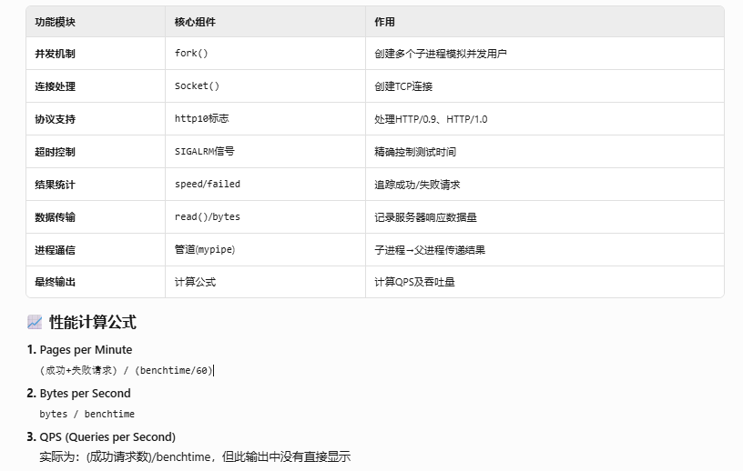
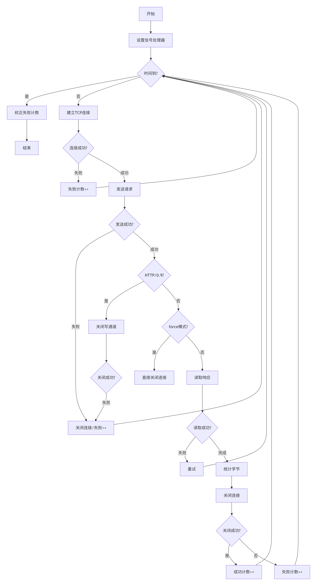
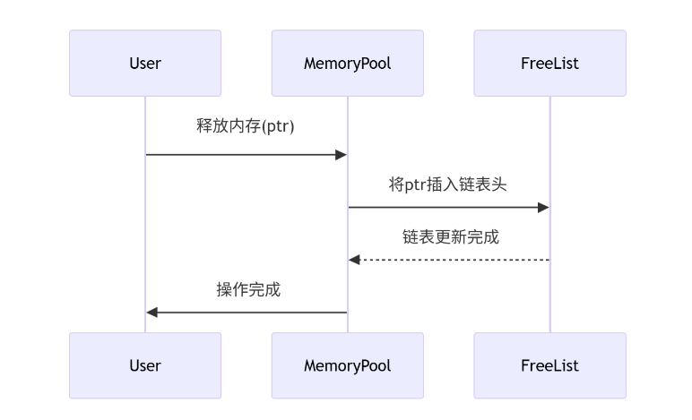
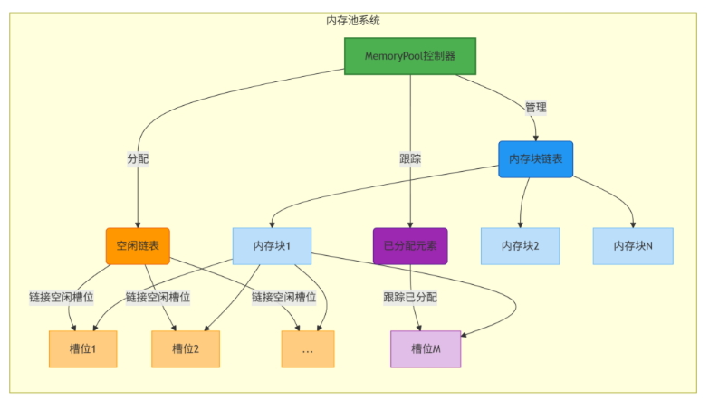
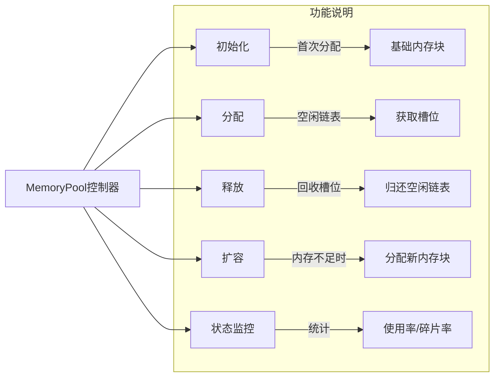
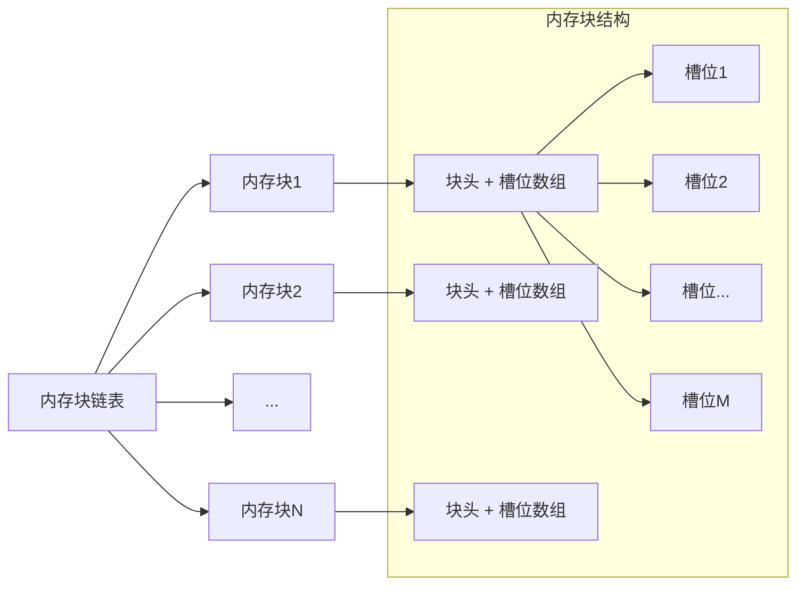
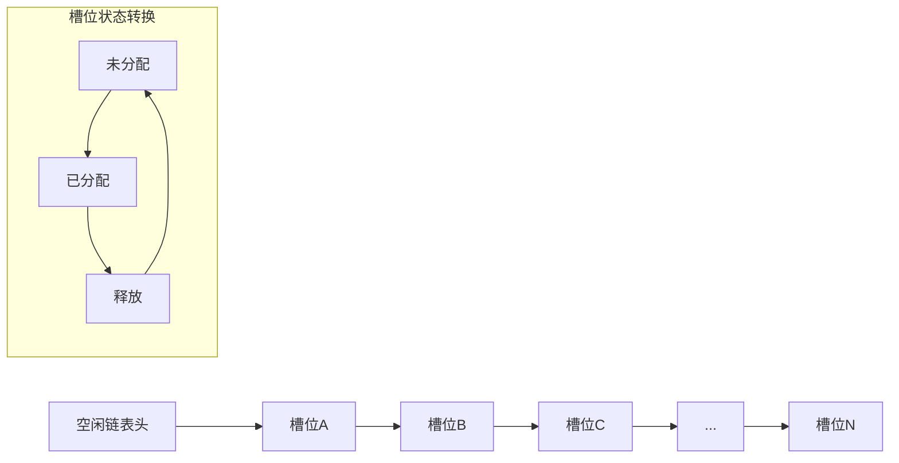

## 消息队列

### 设计思路



### std::ref



### const T&

- 避免拷贝
- 保证对象不被修改
- 接收临时对象 const引用可以接收临时对象 比如右值
- 避免对象切割 按值传递时派生类对象会发生对象切割 引用可以保持多态行为

```cpp
class Animal { public: virtual void sound() const = 0; };
class Dog : public Animal { public: void sound() const override { std::cout << "Woof!"; } };

void slice(Animal a) { a.sound(); }  // 错误：只调用Animal的sound
void proper(const Animal& a) { a.sound(); } // 正确：多态调用

int main() {
    Dog dog;
    slice(dog);     // 输出（错误）：无声音（纯虚函数调用错误）
    proper(dog);    // 输出（正确）："Woof!"
}
```
### 右值窃取
```cpp
    std::string msg = queue_.front();   //可以优化为右值窃取
    auto msg = std::move(queue_.front());
```

### lock_guard && unique_lock
*lock_guard*
- 简单轻量（RAII 封装）
- 无额外状态，仅栈空间（约 8-16 字节）
- 构造时加锁，析构时解锁
​- ​不可手动解锁​​
- 性能：lock_guard 比手写 lock/unlock 快约 2-3ns

*unique_lock*
- 状态机模型（管理锁状态）
- 额外状态：锁状态、是否拥有（约 32-48 字节）
- 支持手动锁/解锁（lock()/unlock()）
- 支持延迟锁定（defer_lock 选项）
- 支持条件变量等待
- 可转移所有权（移动语义）
- 性能：比 lock_guard 慢约 5-10ns（用于条件变量时必要开销）


### 条件变量condition_variable

条件变量中必须使用unique_lock 其内部需要手动加锁解锁，lock_guard不支持 `cv_.wait(lock, predicate)`等价于
```cpp
while (!predicate()) {
    // 原子操作：解锁 + 等待
    cv_.wait_internal(lock);
    // 唤醒后重新加锁
}
```

内部流程示意
```cpp
void condition_variable::wait(unique_lock<mutex>& lk, Predicate pred) {
    while (!pred()) {
        // 1. 解锁关联的mutex
        lk.unlock(); 
        // 2. 进入等待状态（内核对象）
        wait_internal();
        // 3. 唤醒后重新加锁
        lk.lock();
    }
}
```

### decltype
- decltype用于编译时类型推导
- 常用于泛型编程结合auto，用于追踪函数的返回值类型

### 线程函数无法推导模板类型

- std::thread构造函数尝试推导生产者函数类型，如果不是明确函数实例则会编译错误，是则成功创建线程
- 这里使用lambda表达式是最好的

*失败代码*
```cpp
MessageQueue<CustomMessage> custom_queue;

std::thread custom_producer(
    producer<CustomMessage>,      // ❌ 问题所在
    std::ref(custom_queue),
    custom_generator,
    4
);
```

*成功代码*
```cpp
template <typename T, typename Generator>
void producer_wrapper(MessageQueue<T>* mq, Generator generator, int count) {
    producer<T>(*mq, generator, count);
}

// 使用
std::thread custom_producer(
    producer_wrapper<CustomMessage, decltype(custom_generator)>, // ✅
    &custom_queue,
    custom_generator,
    4
);
```


1. producer<CustomMessage> 是什么
- 它是一个​​函数模板​​，不是具体的函数实例
- 模板签名：template <typename Generator> void producer(...)

2. ​​std::thread 的限制：
- std::thread 构造函数要求​​具体函数指针或可调用对象​​
- 不能直接传递​​部分特化的模板​

3. 之前也是这个producer模板类，之前的模板初始化确实是不完整的，没有明确实例化

## 模板

### 模板特化
- 模板特化是 C++ 模板编程中的高级技术，它允许开发者​​为特定类型提供自定义实现​​。
- 全特化    为所有模板参数指定具体类型
- 部分特化  为部分模板参数指定具体类型

特化的工作机制
- 检查是否有完全匹配的特化
- 检查是否有部分特化
- 使用通用模板

```cpp
// 通用模板
template<typename T>
void process(T obj) { 
    // 通用逻辑 
}

// int 类型的全特化
template<>
void process<int>(int num) {
    // 为int优化的逻辑
}

// 指针类型的部分特化
template<typename U>
void process(U* ptr) {
    // 为指针优化的逻辑
}
```

#### 完全特化
具体到某个类型
```cpp
#include <iostream>
#include <string>

// 通用模板定义
template <typename T>
void process(T value) {
    std::cout << "通用处理: " << value << std::endl;
}

// 完整特化：int类型
template <>
void process<int>(int value) {
    std::cout << "int 特化: " << value * 2 << std::endl;
}

// 完整特化：std::string类型
template <>
void process<std::string>(std::string value) {
    std::cout << "字符串 特化: Hello " << value << "!" << std::endl;
}

int main() {
    process(3.14);      // 通用处理: 3.14
    process(10);        // int 特化: 20
    process("World");   // 字符串 特化: Hello World!
}
```

#### 部分特化
对于部分类型进行特化，也是没有完全指定具体类型

```cpp
#include <iostream>
#include <vector>
#include <type_traits>

// 通用模板定义
template <typename T>
struct Processor {
    static void execute(T value) {
        std::cout << "通用处理器: " << value << std::endl;
    }
};

// 部分特化：指针类型
template <typename T>
struct Processor<T*> {
    static void execute(T* value) {
        std::cout << "指针特化: 地址=" << value 
                  << " 值=" << *value << std::endl;
    }
};

// 部分特化：容器类型
template <typename T>
struct Processor<std::vector<T>> {
    static void execute(const std::vector<T>& vec) {
        std::cout << "容器特化: ";
        for (const auto& item : vec) {
            std::cout << item << " ";
        }
        std::cout << std::endl;
    }
};

// 实际使用代码
int main() {
    int num = 42;
    std::vector<std::string> words {"C++", "Templates", "Partial", "Specialization"};
    
    Processor<int>::execute(10);         // 通用处理器: 10
    Processor<int*>::execute(&num);     // 指针特化: 地址=0x7ffdf9b82a54 值=42
    Processor<decltype(words)>::execute(words); // 容器特化: C++ Templates Partial Specialization 
}
```

### optional
std::optional 是 C++17 引入的一个模板类，用于表示一个可能包含值的对象。它提供了一种类型安全的方式来表示"可能有值"或"没有值"的情况，避免了使用特殊值（如 -1、nullptr 等）或额外的布尔变量。
- std::optional 提供了一种类型安全、表达力强的方式来处理可能缺失的值，是现代 C++ 中处理可选值的推荐方式。

std::optional<T> 可以：
- 包含一个类型为 T 的值
- 或者不包含任何值（空状态）

它特别适合用于以下场景：
- 可能失败的函数返回值
- 可选的数据成员
- 延迟初始化
- 查找操作（可能找不到结果）

```cpp
#include <iostream>
#include <optional>
#include <string>
#include <vector>
#include <functional>

// 查找函数：可能找不到元素
std::optional<size_t> findIndex(const std::vector<int>& vec, int value) {
    for (size_t i = 0; i < vec.size(); ++i) {
        if (vec[i] == value) {
            return i;
        }
    }
    return std::nullopt;
}

// 复杂对象构造
class Configuration {
public:
    Configuration(int level, const std::string& name) 
        : level_(level), name_(name) {}
    
    void print() const {
        std::cout << "Config: " << name_ << " (Level " << level_ << ")\n";
    }

private:
    int level_;
    std::string name_;
};

// 工厂函数：可能返回空
std::optional<Configuration> loadConfiguration(bool valid) {
    if (valid) {
        return Configuration{5, "Production"};
    }
    return std::nullopt;
}

int main() {
    // 1. 基本使用
    std::optional<int> maybeNumber;
    std::cout << "maybeNumber has value: " << maybeNumber.has_value() << "\n";
    
    maybeNumber = 42;
    if (maybeNumber) {
        std::cout << "Number is: " << *maybeNumber << "\n";
    }
    
    // 2. 使用 value_or
    std::optional<std::string> maybeName;
    std::cout << "Name: " << maybeName.value_or("Unknown") << "\n";
    maybeName = "Alice";
    std::cout << "Name: " << maybeName.value_or("Unknown") << "\n";
    
    // 3. 函数返回值处理
    std::vector<int> numbers = {10, 20, 30, 40, 50};
    auto index = findIndex(numbers, 30);
    
    if (index) {
        std::cout << "Found at index: " << *index << "\n";
    } else {
        std::cout << "Value not found\n";
    }
    
    // 4. 使用 emplace 原地构造
    std::optional<Configuration> config;
    config.emplace(3, "Development"); // 直接构造对象
    config->print();
    
    // 5. 高级：链式操作（C++23）
    auto validConfig = loadConfiguration(true);
    auto invalidConfig = loadConfiguration(false);
    
    std::cout << "\nValid config: ";
    if (validConfig) validConfig->print();
    
    std::cout << "Invalid config: ";
    if (!invalidConfig) std::cout << "Not available\n";
    
    // 6. 异常处理
    try {
        auto badAccess = invalidConfig.value(); // 抛出异常
    } catch (const std::bad_optional_access& e) {
        std::cout << "\nCaught exception: " << e.what() << "\n";
    }
    
    // 7. 交换操作
    std::optional<int> a = 10;
    std::optional<int> b = 20;
    std::cout << "\nBefore swap: a=" << *a << ", b=" << *b << "\n";
    a.swap(b);
    std::cout << "After swap: a=" << *a << ", b=" << *b << "\n";
    
    // 8. 重置值
    a.reset();
    std::cout << "After reset: a has value? " << a.has_value() << "\n";
    
    return 0;
}

常用api

检查值是否存在
std::optional<std::string> name = "Alice";

// 使用 has_value()
if (name.has_value()) {
    // 有值时的处理
}

// 使用 bool 转换
if (name) {
    // 有值时的处理
}

// 检查是否为空
if (!name) {
    // 空状态处理
}

访问值
std::optional<double> price = 19.99;

// 使用 value() - 如果为空会抛出 std::bad_optional_access
double p = price.value();

// 使用 value_or() - 提供默认值
double safePrice = price.value_or(0.0);

// 使用 * 运算符（不解引用空值）
if (price) {
    double p = *price;
}

// 使用 -> 运算符访问成员
std::optional<std::string> text = "Hello";
if (text) {
    size_t len = text->length();
}


```

### initializer_list 列表初始化

std::initializer_list 是 C++11 引入的一个模板类，用于表示初始化列表。它提供了一种简洁、统一的方式来处理花括号 {} 初始化语法

头文件：
- <initializer_list>

主要用途：
- 构造函数的初始化列表参数
- 函数参数传递初始化列表

特性
- 轻量级容器，提供只读访问
- 元素在内存中连续存储
- 生命周期由编译器管理
- 支持范围 for 循环

成员函数：
- begin()	返回指向第一个元素的迭代器
- end()	返回指向末尾的迭代器
- size()	返回元素数量
- empty()	检查列表是否为空

使用方法 构造函数

```cpp
#include <initializer_list>
#include <iostream>
#include <vector>

class MyArray {
public:
    // 支持初始化列表的构造函数
    MyArray(std::initializer_list<int> list) 
        : size_(list.size()), data_(new int[list.size()]) 
    {
        std::copy(list.begin(), list.end(), data_);
        std::cout << "Constructed with initializer_list\n";
    }
    
    void print() const {
        for (size_t i = 0; i < size_; ++i) {
            std::cout << data_[i] << " ";
        }
        std::cout << "\n";
    }
    
    ~MyArray() { delete[] data_; }

private:
    size_t size_;
    int* data_;
};

int main() {
    // 使用初始化列表构造对象
    MyArray arr = {1, 2, 3, 4, 5};
    arr.print();
    
    // 标准库容器也使用相同机制
    std::vector<int> vec = {10, 20, 30};
    for (int n : vec) {
        std::cout << n << " ";
    }
    return 0;
}
```

自定义类型推导
```cpp
#include <initializer_list>
#include <type_traits>

template <typename T>
class MyContainer {
public:
    MyContainer(std::initializer_list<T> list) {
        // 构造实现
    }
    
    // 对于异构初始化列表（需要C++17）
    template <typename... Ts>
    MyContainer(Ts&&... args) {
        // 需要处理类型转换
    }
};

// 使用
MyContainer<int> mc1 = {1, 2, 3}; // OK

// C++17 支持类模板参数推导
MyContainer mc2 = {1, 2, 3}; // 推导为 MyContainer<int>
```

{}列表初始化与 initializer_list区别
- std::initializer_list：是定义在 <initializer_list> 中的模板类，是一个轻量级容器，表示初始化列表，主要用于构造函数的参数类型
- {}是语法糖，std::initializer_list是标准库工具，比如在函数参数传递初始化列表就需要std::initializer_list
- std::initializer_list会返回类型，可以是容器类型，提供begin,end，size,empty等方法

函数参数传递初始化列表
```cpp
// 只能使用 initializer_list
void process(std::initializer_list<int> values) {
    for (int v : values) {
        // 处理每个值
    }
}

process({1, 2, 3}); // 正确 ✅
process{1, 2, 3};    // 错误 ❌

```

```cpp
template <typename T>
class FlexibleContainer {
public:
    // 通用构造函数
    template <typename... Args>
    FlexibleContainer(Args... args);
    
    // 特化的初始化列表版本
    FlexibleContainer(std::initializer_list<T> init);
};

// 调用区分
FlexibleContainer<int> a(1, 2, 3); // 调用通用版本
FlexibleContainer<int> b{1, 2, 3};   // 调用initializer_list版本
```

## WebBench源码阅读

### 主要函数

* alarm_handler 信号处理函数，时钟结束时进行调用。
* usage 输出 webbench 命令用法
* main 提供程序入口...
* build_request 构造 HTTP 请求
* bench 派生子进程，父子进程管道通信最后输出计算结果。
* benchcore 每个子进程的实际发起请求函数。

### 主要流程

说一下程序执行的主要流程：

1. 解析命令行参数，根据命令行指定参数设定变量，可以认为是初始化配置。
2. 根据指定的配置构造 HTTP 请求报文格式。
3. 开始执行 bench 函数，先进行一次 socket 连接建立与断开，测试是否可以正常访问。
4. 建立管道，派生根据指定进程数派生子进程。
5. 每个子进程调用 benchcore 函数，先通过 sigaction 安装信号，用 alarm 设置闹钟函数，接着不断建立 socket 进行通信，与服务器交互数据，直到收到信号结束访问测试。子进程将访问测试结果写进管道。
6. 父进程读取管道数据，汇总子进程信息，收到所有子进程消息后，输出汇总信息，结束。

- 父进程：fork() 返回子进程PID（继续循环）
- 子进程：fork() 返回0（跳出循环）
- 错误：fork() 返回负数（报错退出）

子进程执行逻辑
```cpp
if (pid == (pid_t)0) {
    /* 执行压测 */
    if (proxyhost == NULL)
        benchcore(host, proxyport, request);
    else
        benchcore(proxyhost, proxyport, request); 
    
    /* 将结果写入管道 */
    f = fdopen(mypipe[1], "w");
    fprintf(f, "%d %d %d\n", speed, failed, bytes); // 成功数 失败数 总字节
    fclose(f);
    return 0;
}
```

benchcore
```cpp
void benchcore(const char* host, const int port, const char* req) {
    // 1. 设置超时处理（SIGALRM信号）
    sa.sa_handler = alarm_handler;
    sigaction(SIGALRM, &sa, NULL);
    alarm(benchtime); // 设置测试时长
    
    // 2. 测试循环
    while (1) {
        if (timerexpired) return; // 超时退出
        
        // 3. 创建TCP连接
        s = Socket(host, port);
        if (s < 0) { failed++; continue; }
        
        // 4. 发送HTTP请求
        if (write(s, req, strlen(req)) != rlen) { 
            failed++; close(s); continue; 
        }
        
        // 5. 处理不同HTTP版本
        if (http10 == 0) shutdown(s, 1); // HTTP/0.9关闭写端
        
        // 6. 接收响应（非强制模式）
        if (force == 0) {
            while (!timerexpired) {
                int n = read(s, buf, sizeof(buf));
                if (n < 0) { // 读取错误
                    failed++; close(s); 
                    goto nexttry; // 重试新连接
                } 
                else if (n == 0) break; // 对端关闭
                else bytes += n;        // 统计字节
            }
        }
        
        // 7. 关闭连接
        if (close(s)) failed++;
        else speed++; // 成功计数
    }
nexttry: ; // 重试标签
}
```





### 超时控制机制
- ​原理​​：使用 alarm(benchtime) + SIGALRM 信号
- ​触发​​：到达测试时间后，内核发送 SIGALRM 信号
- ​处理​​：alarm_handler 设置 timerexpired=1
- ​作用​​：确保测试精确控制在指定时间内

### 超时错误机制处理
这里相当于是多进程，所以每个进程都会看到timerexpired初值设置为0后续被修改为1每个进程仅有一次
```cpp
volatile int timerexpired = 0;
static void alarm_handler(int signal) {
    timerexpired = 1;
}
```
假设在5秒测试结束时：

- 2500个并发客户端中
- 有20个正阻塞在connect()调用
- ​信号中断会导致：​​
    - 20次failed++ ➔ 如果不修正
    - 最终报告20次失败（实际是测试中断引起）

## threadpool
完美引用+万能转发 避免资源的二次拷贝 完全由引用主导，提高效率 注意这里使用F通常表示可调用对象
```cpp
template<class F>   //F通常表示可调用对象
void AddTask(F&& task){ //万能引用 既可以当左值引用 又可以当右值引用
    {
        std::lock_guard<std::mutex> lock(pool_->mutex_);
        pool_->tasks_.emplace(std::forward<F>(task));   //完美转发
    }
    pool_->cv_.notify_one(); //接收到任务响应条件变量
}
```
`static_cast<bool>(pool_)` 当 pool_ 持有有效对象 → true
当 pool_ 为 nullptr → false
- 检测 pool_ 是否指向有效对象​​
- ​只在有效时执行资源清理​​
- ​避免在无效或已移动对象上操作​​

### threadpool-C语言版本

线程池单参数处理办法

```cpp
// 定义参数结构体
typedef struct {
    int user_id;
    char *username;
    double balance;
} AccountTaskParams;

// 任务函数
void account_task(void *arg) {
    AccountTaskParams *params = (AccountTaskParams *)arg;
    
    printf("Processing account:\n");
    printf("  ID: %d\n", params->user_id);
    printf("  Name: %s\n", params->username);
    printf("  Balance: %.2f\n", params->balance);
    
    // 清理资源
    free(params->username);
    free(params);
}

// 添加任务
void add_account_task(threadpool_t *pool, int id, const char *name, double balance) {
    // 分配并初始化参数
    AccountTaskParams *params = malloc(sizeof(AccountTaskParams));
    params->user_id = id;
    
    // 字符串需要独立分配内存
    params->username = strdup(name);  // 复制字符串
    params->balance = balance;
    
    threadpool_add(pool, account_task, params, 0);
}

// 使用示例
add_account_task(pool, 101, "John Doe", 1234.56);
```

```cpp
for(i = 0; i < thread_count; i++) {
    // 创建线程
    if(pthread_create(&(pool->threads[i]), NULL, 
                      threadpool_thread, (void*)pool) != 0) {
        // 创建失败时销毁线程池
        threadpool_destroy(pool, 0);
        return NULL;
    }
    // 更新线程计数
    pool->thread_count++;
    pool->started++;
}
```

结构体嵌套
```c

/* 定义错误码 */
typedef enum {
    threadpool_invalid        = -1,
    threadpool_lock_failure   = -2,
    threadpool_queue_full     = -3,
    threadpool_shutdown       = -4,
    threadpool_thread_failure = -5
} threadpool_error_t;

typedef struct {
    void (*function)(void *);
    void *argument;
} threadpool_task_t;

struct threadpool_t {
  pthread_mutex_t lock;
  pthread_cond_t notify;
  pthread_t *threads;
  threadpool_task_t *queue;
  int thread_count;
  int queue_size;
  int head;
  int tail;
  int count;
  int shutdown;
  int started;
};
```

### stl迭代器

- 迭代器返回的指针
- 包括initializer_list返回的也是指针类型
- 迭代器的黄金法则：​​begin() 指向第一个元素，end() 指向 "最后一个元素 + 1"，永远不要解引用 end()。​


end() 是什么​​：
- end() 返回一个特殊的位置标记（尾后迭代器）
- 它​​不指向有效元素​​，而是表示容器的结束位置
- 解引用 end() 会导致未定义行为（可能崩溃或输出垃圾值）

```cpp
std::vector<int> numbers = {10, 20, 30, 40, 50};

auto it = numbers.begin();

// 解引用访问值
int first = *it; // 10

// 算术运算
auto third = it + 2; // 指向30
std::cout << *(it + 2); // 30

// 比较运算符
if (it < numbers.end()) {
    // ...
}

// 递增/递减
it += 3; // 现在指向40
it--;    // 现在指向30

// 下标访问
auto second = it[1]; // 相当于*(it + 1), 40

// 距离计算
auto dist = numbers.end() - numbers.begin(); // 5
```

### const引用
```cpp
    T& operator [](size_t count) { return data[count]; }
    const T& operator [](size_t count) const { return data[count]; }
```
上述二者调用形式不同

### traits技术

```cpp

#include <type_traits>

template <typename T>
struct get_type
{
	using type = T;
};

//如果是指针即可获得其指向的类型，相当于这里只对指针类型做处理 模板特化
template <typename T>
struct get_type<T*>
{
	using type = T;
};

template <typename T>
MyArray<T>::MyArray(const std::initializer_list<T>& list)
{//这里需要避免指针浅复制 ： 1.模板特化 2.traits技术
	if(list.size())
	{
		unsigned count = 0;
		data = new T[list.size()]();
		if(std::is_pointer<T>::value)
		{
            for(const auto& elem : list)
			{
			    data[count++] = new typename get_type<T>::type(*elem);//typename表示新的类型
			}

		}
		else
		{
			for(const auto& elem : list)
			{
				data[count++] = elem;
			}
		}
	}
	else
	{
		data = nullptr;
	}
}
```

### 模板默认参数

```cpp
namespace mystd
{
    using void_int_func_type = std::function<void(int&)>;
    template<typename iter_type, typename func_type >
    void for_each(iter_type first, iter_type last, func_type func = [](int& elem){
        ++elem;
    })
    {
        for(auto iter = first; iter != last; ++iter){
            func(*iter);
        }
    }

    template<typename T>
    class MyVector
    {
    public:
        template<typename T2>
        void output(const T2& elem)
        {
            std::cout << elem << std::endl;
        }
    };

} // namespace mystd
```

### 修复内存泄漏
因为这里data是T*类型，​
- 内存泄漏​​：在指针类型初始化时 (std::is_pointer<T>::value)，通过 new 分配了内存但析构函数只释放了 data[] 数组本身，没有释放每个元素指向的内存
​- ​双重释放风险​​：当使用右值引用版本的构造函数时，如果 T 是指针类型，只进行了浅拷贝，可能导致多个对象管理相同内存

```cpp
template<typename T>
class MyArray
{
	using iterator = T*;
	using const_iterator = const T*;
public:
	MyArray(size_t count) : m_size(count){};
	~MyArray();
	MyArray(const std::initializer_list<T>& list);
	MyArray(std::initializer_list<T>&& list);
	iterator begin() const;
	
	const_iterator cbegin() const;

	T& operator [](unsigned count) const
	{
		return data[count];
	}

private:
	T* data;
	size_t m_size;
	// std::vector<T> data;
};

template <typename T>
MyArray<T>::~MyArray()
{
    if (data) {
        if (std::is_pointer<T>::value) {
            for (size_t i = 0; i < m_size; ++i) {
                if (data[i]) {
                    delete data[i];
                }
            }
        }
        delete[] data;
    }
}
```

### constexpr
- 编译器报告 unary '*' 错误的原因。要解决这个问题，必须确保当 T` 不是指针类型时，相关的代码不会被实例化或编译。
```cpp
Vector(const std::initializer_list<T>& list){
        size_ = list.size();
        capacity_ = list.size();
        if(list.size()){
            size_t count = 0;
            data = new T[list.size()]();
            if constexpr (std::is_pointer<T>::value)
            {
                //  T为int时 此时条件为false 但是编译器还是会选择编译这部分代码
                //  编译器报告 unary '*' 错误的原因。要解决这个问题，必须确保当 T` 不是指针类型时，相关的代码不会被实例化或编译。
                for(const auto& elem : list){
                    data[count++] = new element_type_t<T>(*elem);
                }
            }
            else 
            {
                for(const auto& elem : list){
                    data[count ++] = elem;
                }
            }
        }
        else{
            data = nullptr;
        }
    }
```

- 编译时决策，不会尝试编译不满足条件的代码块
- 解决类型不匹配问题
- 代码清晰简洁


## 内存池

这些api是STL allocator提供的，我们在重构内存池的时候相当于重构这些函数，这样在自己实现一个数据结构亦或者使用其他STL容器时可以兼容这内存池，我们的MemeryPool也是Allocater类型

```cpp

#ifndef MEMORY_POOL_H
#define MEMORY_POOL_H

#include <limits.h>
#include <stddef.h>

template <typename T, size_t BlockSize = 4096>
class MemoryPool
{
  public:
    /* Member types */
    typedef T               value_type;       // T 的 value 类型
    typedef T*              pointer;          // T 的 指针类型
    typedef T&              reference;        // T 的引用类型
    typedef const T*        const_pointer;    // T 的 const 指针类型
    typedef const T&        const_reference;  // T 的 const 引用类型
    typedef size_t          size_type;        // size_t 类型
    typedef ptrdiff_t       difference_type;  // 指针减法结果类型

    // 这个来源于 allocate 的标准
    template <typename U> struct rebind {
      typedef MemoryPool<U> other;
    };

    /* Member functions */
    /* 构造函数 */
    MemoryPool() throw();
    MemoryPool(const MemoryPool& memoryPool) throw();
    template <class U> MemoryPool(const MemoryPool<U>& memoryPool) throw();

    /* 析构函数 */
    ~MemoryPool() throw();

    /* 元素取址 */
    pointer address(reference x) const throw();
    const_pointer address(const_reference x) const throw();

    // Can only allocate one object at a time. n and hint are ignored
    // 分配和收回一个元素的内存空间
    pointer allocate(size_type n = 1, const_pointer hint = 0);
    void deallocate(pointer p, size_type n = 1);

    // 最大大小
    size_type max_size() const throw();

    // 基于内存池的元素构造和析构
    void construct(pointer p, const_reference val);
    void destroy(pointer p);

    // 自带申请内存和释放内存的构造和析构
    pointer newElement(const_reference val);
    void deleteElement(pointer p);

  private:
    // union 结构体,用于存放元素或 next 指针
    union Slot_ {
      value_type element;
      Slot_* next;
    };

    typedef char* data_pointer_;  // char* 指针，主要用于指向内存首地址
    typedef Slot_ slot_type_;     // Slot_ 值类型
    typedef Slot_* slot_pointer_; // Slot_* 指针类型

    slot_pointer_ currentBlock_;  // 内存块链表的头指针
    slot_pointer_ currentSlot_;   // 元素链表的头指针
    slot_pointer_ lastSlot_;      // 可存放元素的最后指针
    slot_pointer_ freeSlots_;     // 元素构造后释放掉的内存链表头指针

    size_type padPointer(data_pointer_ p, size_type align) const throw();  // 计算对齐所需空间
    void allocateBlock();  // 申请内存块放进内存池
   /*
    static_assert(BlockSize >= 2 * sizeof(slot_type_), "BlockSize too small.");
    */
};

#include "MemoryPool.tcc"

#endif // MEMORY_POOL_H

```


* allocate    分配一个对象所需的内存空间 
    - 入参1：size_type n - 要分配的对象数量（​​默认为1​​）
    - 入参2：const_pointer hint - 内存分配提示（​​默认为0/nullptr​​）
* deallocate   释放一个对象的内存（归还给内存池，不是给操作系统）
    - 入参1：pointer p - 要释放的内存块的​​起始指针​​
    - 入参2：size_type n - 要释放的对象数量（​​默认为1​​）
* construct   在已申请的内存空间上构造对象
    - 入参1：pointer p - 已分配但未初始化的​​内存位置指针​​
    - 入参2：const_reference val - 用于构造的​​源对象引用​
* destroy  析构对象
    - 入参：pointer p - 要销毁对象的​​指针​
* newElement  从内存池申请一个对象所需空间，并调用对象的构造函数
    - 入参：const_reference val - 用于构造的​​源对象引用​
* deleteElement  析构对象，将内存空间归还给内存池
    - 入参：pointer p - 要销毁的​​对象指针​
* allocateBlock  从操作系统申请一整块内存放入内存池

### 典型应用场景
1. 内存分配+构造
```cpp
pointer p = allocate(1);       // 分配内存
construct(p, T());             // 在内存上构造对象
```

2. 完整和对象构造
```cpp
pointer p = newElement(T());   // 等价于 new T()
```

3. 对象销毁加内存释放
```cpp
destroy(p);                    // 调用析构函数
deallocate(p, 1);             // 释放内存

// 或等价操作：
deleteElement(p);             // 一步完成
```

StackAlloc.h 自写栈容器函数
```cpp

#ifndef STACK_ALLOC_H
#define STACK_ALLOC_H

#include <memory>

template <typename T>
struct StackNode_
{
  T data;
  StackNode_* prev;
};

/** T is the object to store in the stack, Alloc is the allocator to use */
template <class T, class Alloc = std::allocator<T> >
class StackAlloc
{
  public:
    typedef StackNode_<T> Node;
    typedef typename Alloc::template rebind<Node>::other allocator;//这里rebind重新绑定

    /** Default constructor */
    StackAlloc() {head_ = 0; }
    /** Default destructor */
    ~StackAlloc() { clear(); }

    /** Returns true if the stack is empty */
    bool empty() {return (head_ == 0);}

    /** Deallocate all elements and empty the stack */
    void clear() {
      Node* curr = head_;
      while (curr != 0)
      {
        Node* tmp = curr->prev;
        allocator_.destroy(curr);
        allocator_.deallocate(curr, 1);
        curr = tmp;
      }
      head_ = 0;
    }

    /** Put an element on the top of the stack */
    void push(T element) {
      Node* newNode = allocator_.allocate(1);
      allocator_.construct(newNode, Node());
      newNode->data = element;
      newNode->prev = head_;
      head_ = newNode;
    }

    /** Remove and return the topmost element on the stack */
    T pop() {
      T result = head_->data;
      Node* tmp = head_->prev;
      allocator_.destroy(head_);
      allocator_.deallocate(head_, 1);
      head_ = tmp;
      return result;
    }

    /** Return the topmost element */
    T top() { return (head_->data); }
  private:
    allocator allocator_;
    Node* head_;
};

#endif // STACK_ALLOC_H

```

### rebind
- rebind是allocator内存池的核心 分配内存时不光需要知道数据类型，还需要一些元数据（指针域）
- rebind 比如List他是三个元素 但是我们在模板类创建时使用的是std::list<int>，其内部还需要rebind把他们组合到一起进行内存分配std::list<int, std::allocator<int>> myList;

```cpp
// List节点结构（简化）
struct ListNode {
    ListNode* next;  // 指针域
    ListNode* prev;  // 指针域
    int data;         // 数据域
};

template <typename T>
class Allocator {
public:
    // 关键：rebind 元编程机制
    template <typename U>
    struct rebind {
        using other = Allocator<U>; // 可重绑定到其他类型
    };
    
    T* allocate(size_t n);
    void deallocate(T* p, size_t n);
    // ...
};

template <typename T, typename Alloc = std::allocator<T>>
class list {
private:
    // 定义内部节点类型
    struct Node {
        T value;
        Node* next;
        Node* prev;
    };
    
    // 关键步骤：重绑定分配器
    using NodeAlloc = typename Alloc::template rebind<Node>::other;
    
    NodeAlloc nodeAllocator; // 节点专用分配器
    
public:
    // 添加元素实现
    void push_back(const T& value) {
        // 用节点分配器分配内存
        Node* newNode = nodeAllocator.allocate(1);
        
        // 构造节点
        new (&newNode->value) T(value); // 构造元素值
        
        // 链接节点
        // ...
    }
};
```

### C++ 对象和内存联系
RAII构造时获取资源，析构时释放资源
new本质上也是先分配内存再进行对象的构造 
对于智能指针的构造 使用make_unique比new优势在于其将对象内存与控制块内存绑定在一起分配，而new操作符是需要两次内存分配
```cpp
std::unique_ptr<Class> ptr(new Class("test"));
std::unique_ptr<Class> ptr = std::make_unique<Class>("test");

```

### placement new
先进行内存的预先分配，在进行对象的构造，在指定内存空间进行对象的构造
可以使用堆的空间，也可以使用栈的空间
```cpp
class Demo{};
char* buf = new char[N * sizeof(Demo) + sizeof(int)];
Demo demo = new(buf) Demo;
demo->~Demo();
//内存释放，如果在堆中调用delete[] buf在栈中，跳出作用域自动释放
```


这里多加的sizeof(int)一般用于存储元数据区 分配内存/对象额外存储的相关数量/地址信息
```cpp
// 在数据区构造多个对象
for (int i = 0; i < N; i++) {
    new (buf + sizeof(int) + i * sizeof(Demo)) Demo();
}

// 在销毁时需要知道对象数量
int* count = reinterpret_cast<int*>(buf); // 从元数据区获取数量
for (int i = 0; i < *count; i++) {
    Demo* obj = reinterpret_cast<Demo*>(buf + sizeof(int) + i * sizeof(Demo));
    obj->~Demo(); // 正确销毁对象
}

```

### union
这里就是联合体的应用之处，union同一时刻只会保存一个值，这里是空闲链表时作为Slot*使用，`allocate分配时使用reinterpret_cast转成需要的数据类型返回`，同时由于这里只进行内存的分配，freeSlots_里面存储内容没有改变，还是下一个freeSlots_的地址,比如下方代码中内存池应用也是先定义模板类型进行allocate

```cpp

slot_pointer_ currentBlock_;  // 内存块链表的头指针
slot_pointer_ currentSlot_;   // 元素链表的头指针
slot_pointer_ lastSlot_;      // 可存放元素的最后指针
slot_pointer_ freeSlots_;     // 元素构造后释放掉的内存链表头指针

union Slot_ {
    value_type element;
    Slot_* next;
};

typedef char* data_pointer_;  // char* 指针，主要用于指向内存首地址
typedef Slot_ slot_type_;     // Slot_ 值类型
typedef Slot_* slot_pointer_; // Slot_* 指针类型

// 返回指向分配新元素所需内存的指针
template <typename T, size_t BlockSize>
inline typename MemoryPool<T, BlockSize>::pointer
MemoryPool<T, BlockSize>::allocate(size_type, const_pointer)
{
  // 如果 freeSlots_ 非空，就在 freeSlots_ 中取内存
  if (freeSlots_ != 0) {
    pointer result = reinterpret_cast<pointer>(freeSlots_);
    // 更新 freeSlots_
    freeSlots_ = freeSlots_->next;
    return result;
  }
  else {
    if (currentSlot_ >= lastSlot_)
      // 之前申请的内存用完了，分配新的 block
      allocateBlock();
    // 从分配的 block 中划分出去
    return reinterpret_cast<pointer>(currentSlot_++);
  }
}

//内存池应用于自己实现的栈数据结构
/** Put an element on the top of the stack */
void push(T element) {
    Node* newNode = allocator_.allocate(1);
    allocator_.construct(newNode, Node());
    newNode->data = element;
    newNode->prev = head_;
    head_ = newNode;
}
```


### 内存池链表及其源码分析

#### 析构函数
```cpp


/* 析构函数，把内存池中所有 block delete 掉 */
template <typename T, size_t BlockSize>
MemoryPool<T, BlockSize>::~MemoryPool()
throw()
{
  slot_pointer_ curr = currentBlock_;
  while (curr != 0) {
    slot_pointer_ prev = curr->next;
    // 转化为 void 指针，是因为 void 类型不需要调用析构函数,只释放空间
    operator delete(reinterpret_cast<void*>(curr));
    curr = prev;
  }
}
```

#### 内存池工作原理

内存池是一个一个的 block 以链表的形式连接起来，每一个 block 是一块大的内存，当内存池的内存不足的时候，就会向操作系统申请新的 block 加入链表。还有一个 freeSlots_ 的链表，链表里面的每一项都是对象被释放后归还给内存池的空间，内存池刚创建时 freeSlots_ 是空的，之后随着用户创建对象，再将对象释放掉，这时候要把内存归还给内存池，怎么归还呢？就是把指向这个对象的内存的指针加到 freeSlots_ 链表的前面（前插）。

用户在创建对象的时候，先检查 freeSlots_ 是否为空，不为空的时候直接取出一项作为分配出的空间。否则就在当前 block 内取出一个 Slot_ 大小的内存分配出去，如果 block 里面的内存已经使用完了呢？就向操作系统申请一个新的 block。

内存池工作期间的内存只会增长，不释放给操作系统。直到内存池销毁的时候，才把所有的 block delete 掉。












### gdb用法

```sh
bt 		#backtrace
run 	#重新运行程序
step	#单步
next	#不进入函数内部
break heartbeat.cpp:40 		#break 打断点在具体某个源文件行号打断点，需要编译时添加调试信息
x 0x555555558061 #查看对应地址数值
x/16xb 0x555555558060 #16进制显示
p pBuffer #查看变量的值与对应地址
p &frameData #查看地址
p &frameData.sync #查看地址
p frameData #查看值
```

### 三级缓存内存池


## thrift


## Web/HTTPServer


### http框架


### 缓存系统


### 缓冲区设计


### 异步日志库


### 会话管理


### 路由管理


### 中间件


### HTTPS